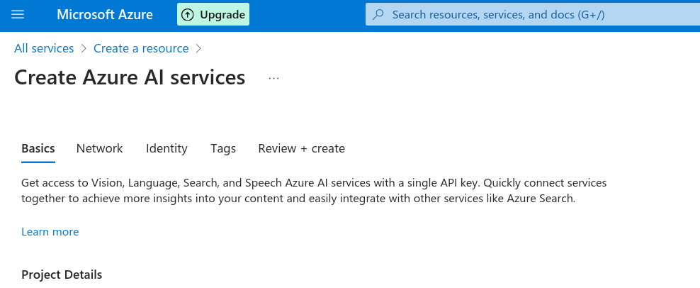
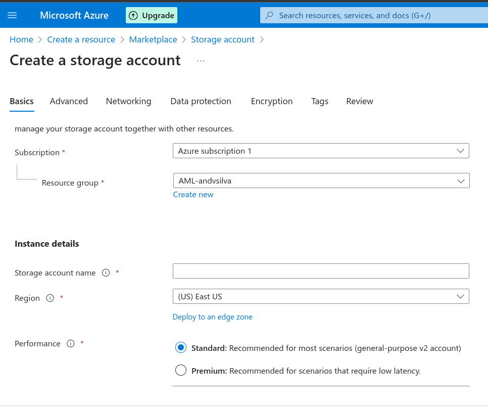
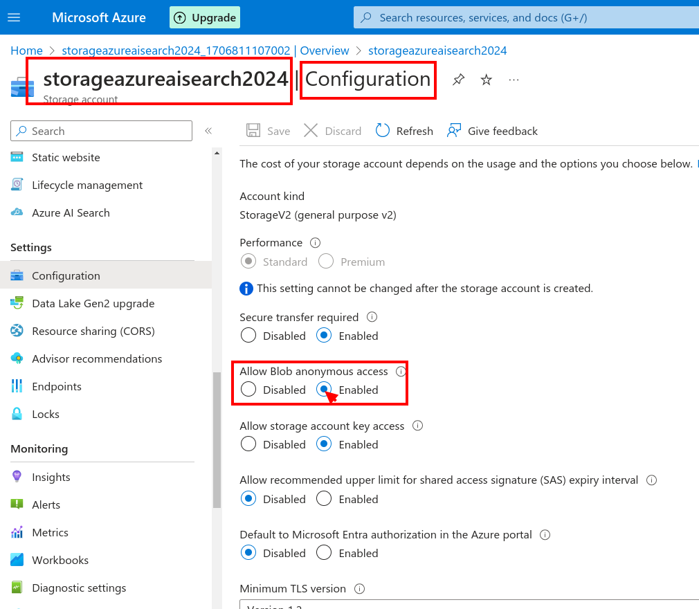
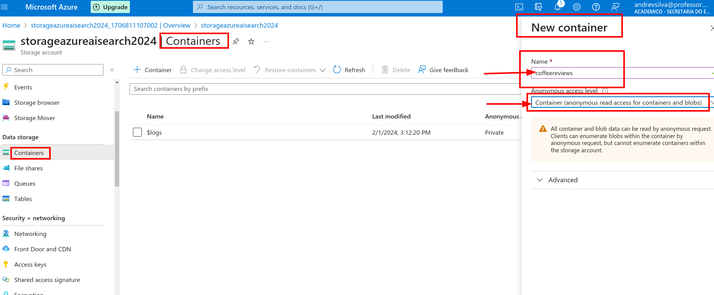
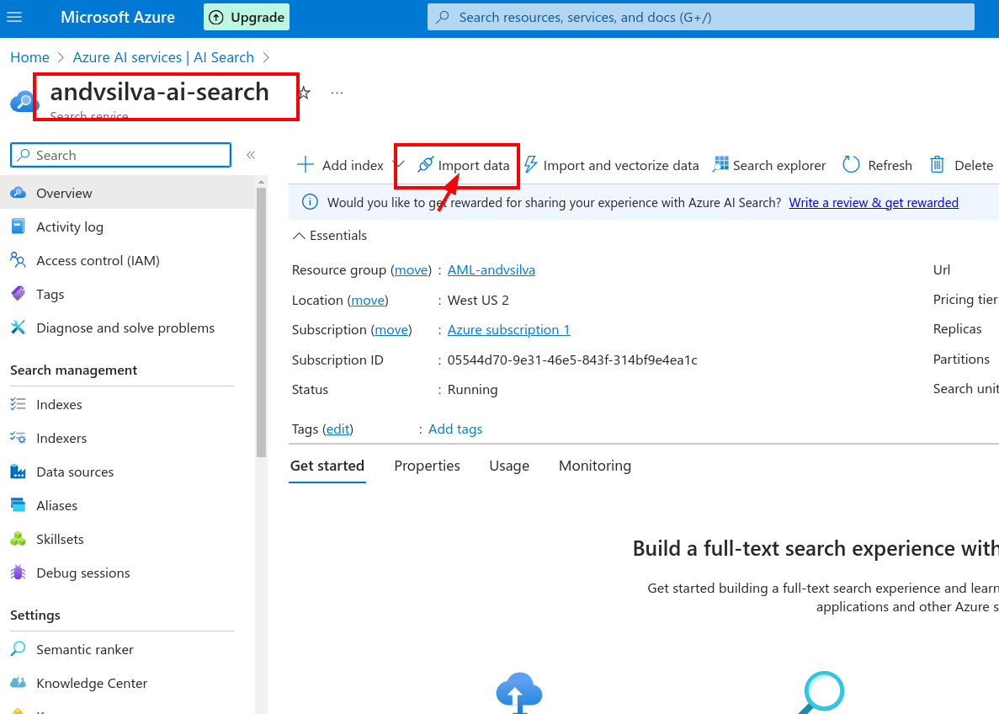

## Azure Cognitive Search: Utilizando AI Search para indexação e consulta de Dados

### Mineracao de Conhecimento

O Azure Cognitive Search: A plataforma de mineracao de conhecimento
alimentada por AI do Azure.

### AI Search

### Create Azure AI services

### Storage Account

### Configuration

Allow Blob anonymous access

### Create Container

### [Explore an Azure AI Search index (UI)](https://microsoftlearning.github.io/mslearn-ai-fundamentals/Instructions/Labs/11-ai-search.html)

- Coffee Reviews - [Link do download](https://aka.ms/mslearn-coffee-reviews)

Now upload reviews to container.

