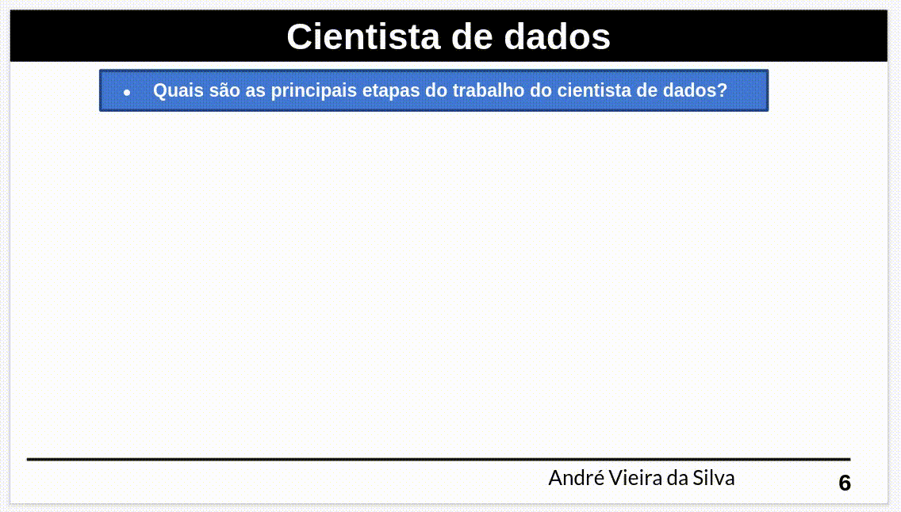

# My Data Science Journey - Studies

Hi there, My name is @andvsilva (see andvsilva/readme for more info), here I will post my studies in Data Science and Machine Learning, articles, books, courses and resources related to the field.

### Data Scientist



## [2022 Python for Machine Learning & Data Science Masterclass](https://www.udemy.com/course/python-for-machine-learning-data-science-masterclass/) - Udemy

```Bash
Learn about Data Science and Machine Learning with Python!
Including Numpy, Pandas, Matplotlib, Scikit-Learn and more!
```

### What you'll learn
- [x] Master critical data science skills.
- [x] Understand Machine Learning from top to bottom.
- [x] Replicate real-world situations and data reports.
- [x] Learn NumPy for numerical processing with Python.
- [x] Conduct feature engineering on real world case studies.
- [x] Learn Pandas for data manipulation with Python.
- [x] Create supervised machine learning algorithms to predict classes.
- [x] Learn Matplotlib to create fully customized data visualizations with Python.
- [x] Create regression machine learning algorithms for predicting continuous values.
- [x] Learn Seaborn to create beautiful statistical plots with Python.
- [x] Construct a modern portfolio of data science and machine learning resume projects.
- [x] Learn how to use Scikit-learn to apply powerful machine learning algorithms.
- [x] Get set-up quickly with the Anaconda data science stack environment.
- [x] Learn best practices for real-world data sets.
Understand the full product workflow for the machine learning lifecycle.
- [x] Explore how to deploy your machine learning models as interactive APIs.

## Useful Resources

- [Machine Learning Canvas - A framework to connect the dots between data collection, machine learning, and value creation](https://medium.com/louis-dorard/from-data-to-ai-with-the-machine-learning-canvas-part-i-d171b867b047)

- [storytelling
with data a data visualization guide
for business professionals, cole nussbaumer knaflic](http://www.bdbanalytics.ir/media/1123/storytelling-with-data-cole-nussbaumer-knaflic.pdf)

- [Data Science Starter Kit](https://towardsdatascience.com/data-science-starter-kit-2d8e2291914b): A guide for getting started in data science (**Very good**)

- [Get Interactive plots directly with pandas](https://towardsdatascience.com/get-interactive-plots-directly-with-pandas-13a311ebf426) - A tutorial on creating Plotly and Bokeh plots directly with Pandas plotting syntax

- [All Python Debugging Tools You Need to Know in 2020](https://medium.com/swlh/all-python-debugging-tools-you-need-to-know-in-2020-e3ff66b8f318)
  This can help you in your journey as data science or data engineer, a valuable skill.

- [Machine Learning model overview](https://medium.com/@cs.sabaribalaji/machine-learning-model-overview-8c305f8f6737)

- [A Practical Guide to Exploratory Data Analysis (EDA) in Python — How to Start Any Data Analysis.](https://medium.com/analytics-vidhya/a-practical-guide-to-exploratory-data-analysis-eda-in-python-how-to-start-any-data-analysis-3fd200516553)
  - EDA is a must for any data project. It is a critical first step that can make your life easier and shed a light on your data.

- [GitHub Actions](https://github.com/features/actions)

- [GitHub Actions: Basics](https://medium.com/intelligentmachines/github-actions-basics-40a4d9b417f8)

- [Get Started With CI/CD Using GitHub Actions](https://medium.com/swlh/get-started-with-ci-cd-using-github-actions-ca32d34b2943)

- [Data Engineering — Basics of Apache Airflow — Build Your First Pipeline](https://towardsdatascience.com/data-engineering-basics-of-apache-airflow-build-your-first-pipeline-eefecb7f1bb9)

- [Managing Machine Learning Life cycle with MLflow](https://medium.com/analytics-vidhya/managing-machine-learning-life-cycle-with-mlflow-3bea291d771b)

- [MySQL on Manjaro](https://medium.com/@rshrc/mysql-on-manjaro-973e4bfc4f05)

- [How To Install MySQL on Ubuntu 20.04](https://www.digitalocean.com/community/tutorials/how-to-install-mysql-on-ubuntu-20-04)

- [SQL For Data Science: A Beginner’s Guide!](https://www.analyticsvidhya.com/blog/2021/06/sql-for-data-science-a-beginners-guide/)

- [Master SQL Fundamentals Effortlessly as a Pandas User](https://towardsdatascience.com/master-sql-fundamentals-effortlessly-as-a-pandas-user-f2159c3f9bfe)

- [Learn Data Science using CRISP-DM Framework](https://medium.com/analytics-vidhya/learn-data-science-using-crisp-dm-framework-473960b2da90)

- [Why using CRISP-DM will make you a better Data Scientist](https://towardsdatascience.com/why-using-crisp-dm-will-make-you-a-better-data-scientist-66efe5b72686)

- [How to Master Python for Data Science](https://towardsdatascience.com/how-to-master-python-for-data-science-1fb8353718bf)

- [Web Scraping with Python For Your Data Science project !](https://www.analyticsvidhya.com/blog/2021/06/perform-web-scraping-with-python/)

- [Interactive Animated Visualization](https://towardsdatascience.com/interactive-animated-visualization-db91d1c858ad)
 
### Programming
- [Introduction to programming](https://beknazarsuranchiyev.medium.com/introduction-to-programming-56dda6a1cbd7)


### Git

- [ Version Control System(VCS)](https://git-scm.com/)
- [The 13 Git Commands I Use Daily](https://medium.com/analytics-vidhya/13-git-commands-i-use-daily-14e3ad562068)
### Python
- [w3schools](https://www.w3schools.com/python/default.asp)
- [Learning Python: From Zero to Hero](https://medium.com/the-renaissance-developer/learning-python-from-zero-to-hero-8ceed48486d5)

### Pandas
- [The Mastery of Pandas - I](https://medium.com/swlh/the-mastery-of-pandas-i-50156db42125)

- [The Mastery of Pandas - II](https://medium.com/analytics-vidhya/the-mastery-of-pandas-ii-bc4cf58c04f5)

 
### Linux

- [20 Basic Linux Commands for Beginners!](https://medium.com/100-days-of-linux/20-basic-linux-commands-for-beginners-78516ab936d6)
- [Basic Linux command line tutorial to start developing in Ubuntu Linux](https://medium.com/@zibon/basic-linux-command-lines-to-get-started-developing-in-ubuntu-linux-b54def1c2190)

### C++

- [How to Learn C++: The Complete Guide for Beginners](https://medium.com/educative/how-to-learn-c-the-complete-guide-for-beginners-eb26b20c7ff0)
- [C++ tutorials](https://www.cplusplus.com/doc/tutorial/variables/)

### Data Science and Machine Learning
- [Notes On Using Data Science & Machine Learning](https://chrisalbon.com/#machine_learning)

  - **Machine Learning - Basics**
  - Vectors, Matrices, And Arrays
  - Preprocessing Structured Data
  - Preprocessing Images
  - Preprocessing Text
  - Preprocessing Dates And Times
  - Feature Engineering
  - Feature Selection
  - Model Evaluation
  - Model Selection
  - Linear Regression
  - Logistic Regression
  - Trees And Forests
  - Nearest Neighbors
  - Support Vector Machines
  - Naive Bayes
  - Clustering
  - **Deep Learning**
    - Setup
    - Keras
    - PyTorch
  - **Python** 
    - Basics
    - Data Wrangling
    - Data Visualization
    - Web Scraping
    - Testing
    - Logging
  - **Statistics**
    - Basics
    - Frequentist
    - Scala
    - Regular Expressions
  - **Snowflake**
    - Basics
    - Tables
  - **PostgreSQL**
    - Basics
    - Add, Delete, Change Rows
    - Merging And Joining
    - Tables
    - Text
    - Numeric
    - Dates
    - Interview Questions
  - **Mathematics**
  - **AWS** Amazon Web Services (AWS) - Cloud Computing Services
  - **Computer Science**
    - Algorithms
  - **Linux Command Line**
    - Basics
    - Inputs And Outputs
    - Search
    - Text
    - Flow Control
    - Processes
    - Shell Scripts
  - **Git And GitHub**
  - **Machine Learning Engineering**
  - **Kubeflow**
  - **Docker**
  - **Dockerfiles**
  - PHP

- [Data Science - medium ](https://medium.com/topic/data-science)
