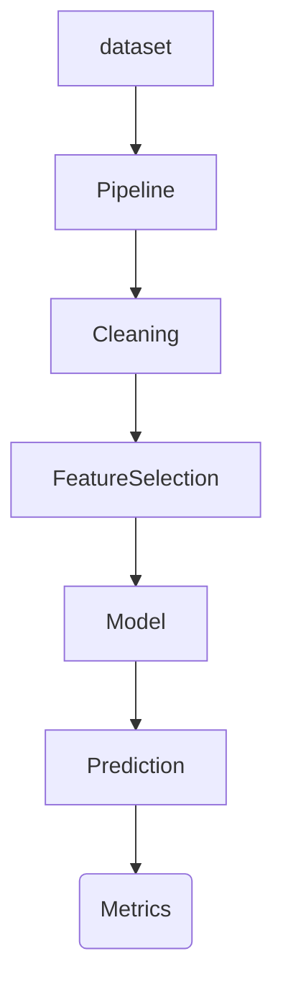

## Machine Learning Workflow/Pipeline.

Here you will see the pipeline for
this simple project to show my skills
in Machine Learning.

```bash
pip install -r requirements.txt

# run 
python model.py
```

### Workflow of the Project



```
$ python model.py 
loading dataset...
    satisfaction  evaluation  projectCount  averageMonthlyHours  ...  turnover  promotion  dept  salary
0           0.09        0.69             6                  187  ...         1          0     4       0
1           0.20        0.53             7                   96  ...         0          0     6       2
2           0.20        0.19             3                  224  ...         0          0     0       2
3           0.53        0.89             1                  158  ...         0          1     9       2
4           0.33        0.77             4                  226  ...         1          0     6       1
..           ...         ...           ...                  ...  ...       ...        ...   ...     ...
95          0.08        0.99             2                  255  ...         0          0     6       2
96          0.76        0.36             3                  207  ...         1          1     1       2
97          0.44        0.23             3                  213  ...         1          0     5       2
98          0.60        0.78             5                  227  ...         0          0     2       0
99          0.03        0.84             3                  240  ...         0          0     4       0

[100 rows x 10 columns]
split dataset in train and test for the model...
call the model - CatBoost Classifier...
training...
0:	learn: 0.6925926	total: 46.2ms	remaining: 4.57s
10:	learn: 0.6540443	total: 47.1ms	remaining: 381ms
20:	learn: 0.6326153	total: 48ms	remaining: 180ms
30:	learn: 0.6071170	total: 51.3ms	remaining: 114ms
40:	learn: 0.5932615	total: 54.7ms	remaining: 78.6ms
50:	learn: 0.5816153	total: 67.5ms	remaining: 64.9ms
60:	learn: 0.5544588	total: 69ms	remaining: 44.1ms
70:	learn: 0.5344084	total: 81.3ms	remaining: 33.2ms
80:	learn: 0.5140107	total: 82.2ms	remaining: 19.3ms
90:	learn: 0.4981101	total: 94.3ms	remaining: 9.33ms
99:	learn: 0.4790555	total: 96.6ms	remaining: 0us
prediction...
performance of the mode...
Accuracy: 0.55
That is for today, a simple demonstration for machine learning project.

```

**Microsoft Azure AI Fundamentals**