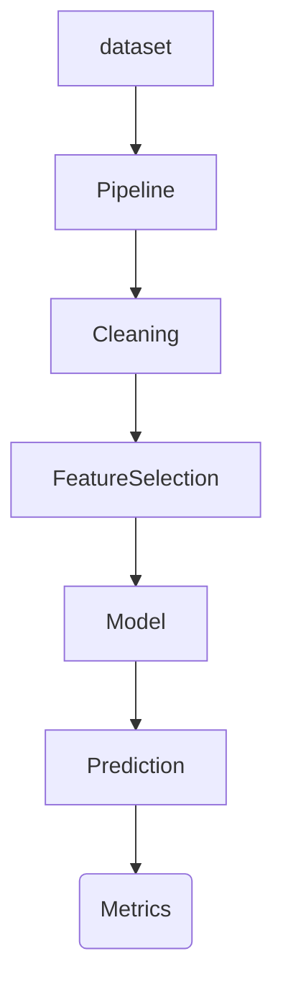

## Machine Learning Workflow/Pipeline.

Here you will see the pipeline for
this simple project to show my skills
in Machine Learning.

```bash
pip install -r requirements.txt

# run 
python model.py
```

### Workflow of the Project



**Microsoft Azure AI Fundamentals**