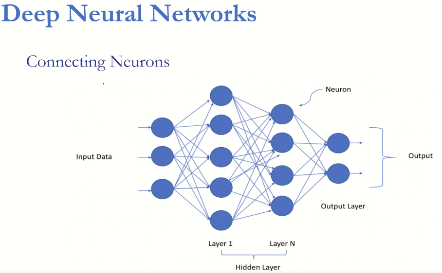

## [Data Science & Machine Learning(Theory+Projects)A-Z 90 HOURS](https://www.udemy.com/course/data-science-machine-learningtheoryprojectsa-z-90-hours/) - Udemy

```Bash
Development > Data Science > Python

About this course
Data Science Python-Learn Statistics for Data Science,
Machine Learning for Data Science, Deep Learning for Data Science

By the numbers
Skill level: All Levels
Students: 2204
Languages: English
Captions: Yes
Lectures: 734
Video: 94 total hours
Certificates
Get Udemy certificate by completing entire course
```

## AI Sciences
### AI Experts & Data Scientists |4+ Rated | 160+ Countries
```bash
We are a group of experts, PhDs and Practitioners of Artificial Intelligence, 
Computer Science, Machine Learning, and Statistics. Some of us work in big 
companies like Amazon, Google, Facebook, Microsoft, KPMG, BCG, and IBM.

We decided to produce a series of courses mainly dedicated to beginners and 
newcomers on the techniques and methods of Machine Learning, Statistics, 
Artificial Intelligence, and Data Science.

Initially, our objective was to help only those who wish to understand these 
techniques more easily and to be able to start without too much theory and 
without a long reading. Today we also publish a more complete course on some 
topics for a wider audience.

Our courses have had phenomenal success. Our Courses have helped more 
than 100,000 students to master AI and Data Science.
```

### What you'll learn
- [x] Key data science and machine learning concepts right from the beginning with a complete unfolding with examples in Python
- [x] Essential Concepts and Algorithms in Machine Learning
- [x] Python for Data Science and Data Analysis
- [x] Data Understanding and Data Visualization with Python
- [x] Probability and Statistics in Python
- [x] Feature Engineering and Dimensionality Reduction with Python
- [x] Artificial Neural Networks with Python
- [x] Convolutional Neural Networks with Python
- [x] Recurrent Neural Networks with Python
- [x] Detailed Explanation and Live Coding with Python
- [x] Building your own AI applications.

## Anaconda Python and Jupyter Install and Setup

```bash
$ uname -a
Operation System: Ubuntu GNU/Linux

# install Anaconda

# Download the script to install (maybe change the version)
$ wget -c https://repo.anaconda.com/archive/Anaconda3-2021.11-Linux-x86_64.sh

# Run the installer script with bash.
$ bash Anaconda3-2021.11-Linux-x86_64.sh

# check the version installed
$ conda --version
conda 4.11.0
```
## Basics - Python

- [x] Numpy
- [x] Pandas
- [x] Matplotlib
- [x] Seaborn Data Visualizations

- SOURCE: [Notes On Using
Data Science & Machine Learning](https://chrisalbon.com/#machine_learning)
# Table of Contents

1. [Section 1: Introduction to the course]()
2. [Section 2: Basics for Data Science: Python for Data Science and data Analysis]()
3. [Section 3: Basics for Data Science: Data Understanding and Data Visualization with Python]()
4. [Section 4: Basics for Data Science: Mastering Probability and Statistics in Python]()
5. [Section 5: Machine Learning Crash Course]()
6. [Section 6: Machine Learning: Feature Engineering and Dimensionality Reduction with Python]()
7. [Section 7: Deep learning: Artificial Neural Networks with Python]()
8. [Section 8: Deep learning: Convolutional Networks with python]()

## Section 1: Introduction to the course

- **Focus - General**
  - Problem solving
  - Why Python?
    - Beginner friendly
    - Versatile and flexible
    - Most mature package libraries around
    - Most popular in Machine Learning world
  - Data Science
  - Live Coding of each and every concept
  - Live Problem Solving Practice
  - Trend Analysis of real Covid-19 data set

## Section 2: Basics for Data Science: Data Understanding and Data Visualization with Python

- **Basics of programming**
  - Understading the Algorithm
  - FlowCharts and Pseudocodes
    - Powerful tool to see the workflow of the algorithm
  - Example of algorithms-Making Tea Problem
  - Example of algorithm-Searching Minimun
  - Example of algorithm-Sorting Problem
  - Sorting Problem in python
  - ipython
  - Jupyter Notebook
  - Anaconda
  - Variable and Operator
  - Bool Data type in Python
  - Comparison in Python
  - Python Useful function
  - Function and Module in Python
    - Function Practice-Output Arguments and Return Statement
    - Variable Number of input Arguments
  - String in Python
    - Methods
  - Data Structures
    - List
    - Tuple
    - Set
    - Dictionary
  - Numpy for Numerical Data processing
  - Pandas for Data Manipulation
    - MatPlotLib
    - Seaborn
  - Scikit-Learn for Machine Learning
    - SVC
    - Random Forest Classifier

## Section 3: Basics for Data Science: Data Understanding and Data Visualization with Python

- Engaging Examples
- Real Data sets
- Numpy more functions
- Images as Numpy arrays
- Manipulating images
- K-nearest-neighbor classifier using Numpy (KNN Classifier)
- Example on iris data
- KNN classifier from Scratch
- Numpy(Structure Data)
- Numpy towars Pandas
- Pandas (Grouping)
- Pandas (Where)
  - ```df.where(cond,action)```
- Pandas (clip)
  - ```df.clip(lower,upper)```
- Pandas (merge)
  - ```df.merge(df1,df2)```
- Pandas (Pivot Tables)
  - ```df.pivot_table()```
- Pandas (to_datetime)
  - ```df.to_datetime()```
- MatPlotLib
  - Visualization
  - Color and styles
  - Lines
  - Markes
  - legend
  - Axes
  - Scatter Plots
  - Contour Plots
  - Histograms
    - ```plt.hist()```
  - Subplots
    - ```plt.subplots()```
  - 3D plots
    - ```bash
      fig = plt.figure() 
      ax  = fig.gca(projection='3d')
      ```
      ```bash
      from matplotlib import cm

      fig = plt.figure(figsize=(8,8))
      ax = fig.gca(projection='3d')
      ax.plot_surface(X,Y,Z, cmap=cm.coolwarm) # 
      ```
  - Density and pairplots from seaborn
    ```bash
    import seaborn as sns
    sns.set()
    ```
  - Seaborn Heatmaps
      ```bash
      import pandas as pd
      import seaborn as sns
      df = pd.DataFrame(np.random.rand(10,10), columns=list('ABCDEFGHIJ'))
      sns.heatmap(df,annot=True,annot_kws={'size':7})
      ```
  - Interactive plotting with Bokeh
  - Interactive 3D plotting with plotly
  - Geographic Data with folium
    - ```pip install folium && conda install folium```

## Section 4: Basics for Data Science: Mastering Probability and Statistics in Python

- Probability vs Statistics
- Sets
- Experiments
- Probability Models
- Random Variables
- Estimation
- Definition Set
  - Unordered collection of distint objects
  - Unordered?
  - Distinct?
  - Object?
- Probability Model: Probability Law
  - From Event to a number
- Probability Model: Probability Axioms
  - Axiomy of Probability
  ```bash
  # A and B are {.....}
  # Rules
  1 - P(A) >= 0 
  2 - P(AUB) = P(A) + P(B) given that A∩B = Empty
      P(A1 U A2 U A3 ...) = P(A1) + P(A2) + P(A3) + ... 
  3 - P(Universe) = 1
  4 - 1 >= P(Event) >= 0
  ```
- Probability Model: Conditioning 
  - Conditional Probability in Machine Learning
    - The basic to know how Machine Learning works link with concepts of statistics
- Probability Model: Law of Total Probability
  - Total Probability Theorem
- **Project: Bayes Classifier**
  - ```jupyter-notebook```: [Bayes Classifier](/course_ds/notebooks/Project_Bayes/Bayes_classifier.ipynb)
  - Dataset: ```iris```
  - Load data
  - Check the columns and plot the data
  - Define X variable and the target y variable
  - Change the y variable (```string names```) to number to work with a classifier
    - Objetive:
      - ```Predict the target y given the variable X```
      - We need to build a probability model ```P(y|X)```:
        - P$(y|X) = \frac{f_{x}(X|y).\mathtt{P}_{y}(y)}{f_{x}(x)}$

## Section 5: Machine Learning Crash Course

- Python Code
  - Feature-Understading
  - Regression using scikit-learn
  - Classification using scikit-learn
  - Clustering using scikit-learn
  - One-Hot-Encoding of Text-Features
  - Regression from scratch in Numpy
  - Classification from scratch in Numpy
  - Clustering from scratch in Numpy
  - Understading Overfitting
  - Dimensionality Reduction using PCA
  - Building Machine Learning Pipelines
  - Cross-validation and Learnig curves
  - Building a Face Recognition pipeline on real face dataset

### Learning From Data
- Supervised Learning
  - Linear Regression
  - Classification
  - Clustering
- Unsupervised Learning
- Reinforcement Learning
- Data Encoding and Preprocessing
  - Images
  - videos
  - Audios
  - Text
    - One Hot Encoding (OHE)
    - Data Standardization
- Model
  - Model is a function in the feature space
    - Dimensions (Number of Features)
    - Parameters
    - Hyperparameters
  - Error/Cost and Optimization
    - Result of training: values of parameters
    - MSE = $\frac{1}{n}\sum_{i=1}^{n}(Y_{i}-\hat{Y}_{i})^{2}$  
      - (```Cross Entropy is a loss function often used in classification problems.```)
  - Build Machine Learning Model from Scratch: Linear Regression
  - Minimum-to-mean distance Classifier
  - K-means Clustering
  - Overfitting, Underfitting and Generalization
    - Overfitting example on Python
    - Regularization
    - Generalization and Validation set
    - Data Snooing and the test set
    - k-fold Cross Validation
    - Performance measures
  - Probability Distributions and Curse of Dimensionality
    - $\mathtt{P}(\mathtt{A}|\mathtt{B})= \frac{\mathtt{P}(\mathtt{B}|\mathtt{A}).\mathtt{P}(\mathtt{A})}{\mathtt{P}(\mathtt{B})}$
  - Dimensionality Reduction PCA (```Principal Component Analysis```)
  - Pipeline
## Section 6: Machine Learning: Feature Engineering and Dimensionality Reduction with Python
- Engaging Examples
- Real Data sets
- Easy Mathematical Foundation with Implementation
- Engaging Activities
- Pythonic
- Feature Selection
- Dimensionality Reduction
- Feature Extraction
- Feature Engineering
  - Categorical Features
  - Text Features

## Section 7: Deep learning: Artificial Neural Networks with Python

- How can we avoid overfitting?
  - [x] Use Simple model
  - [x] Sample More Training Data
  - [x] Apply Regularization
  
- PyTorch Installation:
  ```Bash
  pip install torch torchvision torchaudio
  ## or 
  conda install pytorch torchvision torchaudio cudatoolkit=10.2 -c pytorch
  ```
  Deep Neural Networks
  - [x] Supervised Learning


### Connecting Neurons

- Activation function

### Optimizing the Loss: Gradient Descent


### Hyperparameters

- [x] Number of layers
- [x] Number of units in each layer
- [x] Activation function
- [x] Initial learning rate
- [x] Batch size
- [x] Drop out ratio
- [x] Weight initialization
- [x] Learning rate decay policy
- [x] Early Stopping patience

DNN - Universal Approximation Theorem

Deep Neural Networks
- Gradient Descent
- Mini Batch
- Covariate Shift
- Batch Normalization

## Section 8: Deep learning: Convolutional Networks with python

- Image Processing
  - Digital Image: Glay
  - Digital Image: RGB
    - Image processing
      - Converting an image to Grayscale in python
      - Image Formation (Dark Camera)
      - Image Blurring/Smoothing
      - General Image Filtering
      - Convolution
      - Edge Detection
      - Image Sharpening
      - Parametric Shape Detection
      - Object Detection
      - Object Recognition
      - Object Localization
        
      - Image Feature Extraction
      - Person Detection: HOG
        - Invariance
          - Shift
          - Scale
          - Rotation
- Deep Learning
- CNNs
- TensorFlow
- Transfer learning
- YOLO, Face Verification, Style Transfer, ...
- Hand Engineering vs CNN
- 2D Convolution in Python [2d_convolution.ipynb](/course_ds/notebooks/cnn/2d_convolution.ipynb)
- CNN: 
  - Convolution as Perceptron
  - Parameter Sharing
  - Filter bank
  - Padding
  - Stride
  - Pooling

## Section 9: Deep learning: Recurrent Neural Networks with python

### For more see:
https://github.com/mermaid-js/mermaid

