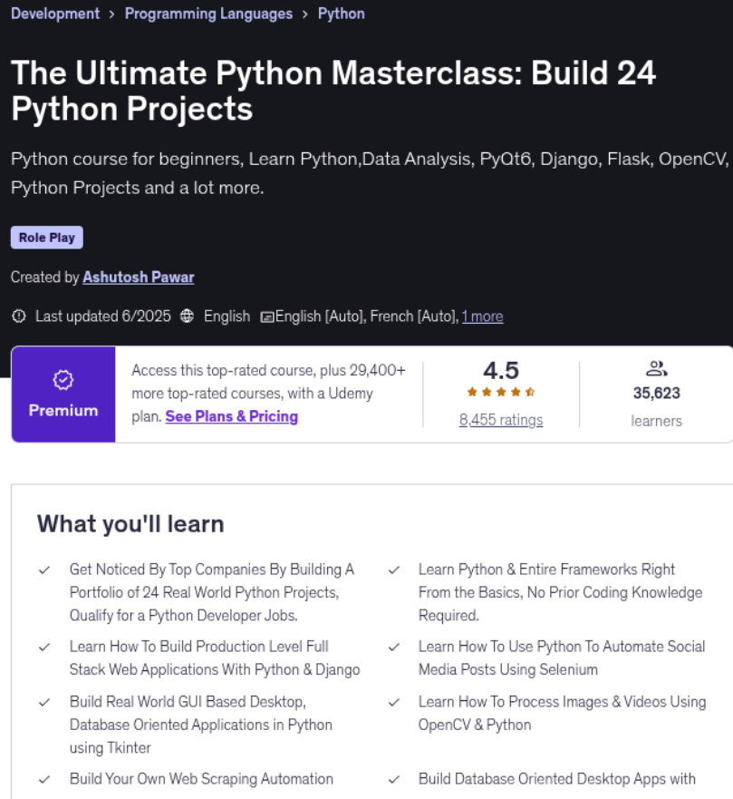

### The Ultimate Python Masterclass: Build 24 Python Projects

This course is designed for beginners who want to learn Python programming language from scratch.

Learn Python right from the basics, understand each and every Python concept in depth and test your knowledge by building a portfolio of production level real world Python projects.

#### The course contains two parts:

1. Python Basics (Section 1 to Section 14)

2. Python Projects(Section 15 to Section 44 )

Here Is What You Get By Enrolling In This Course:

Word-By-Word Explanation: In the entire course, I explain each line of code, without skipping a single line of code.

High Quality Content: Over 77+ hours HD(1080p) Videos.

Well Structured & Easy To Learn: Course has been specially designed to make it easy for the students to learn Python, Django, Data Analysis, PyQt6, Flask, Tkinter, OpenCV, File Compression, Desktop App development with PostgreSQL & Web Scraping.

24 X 7 Support: I will always be there to guide you in your journey to become Python expert.

Here Is Everything You Will Learn In This Complete Course:

In this hands-on course, you will learn Python right starting from scratch to the level where you can build almost anything with it, be it a fully functional database oriented web application or an automation tool.

This course will teach you Python right from scratch from a very basic level and will gradually move you towards more advanced topics.

We not just cover all the Python basics but also the most popular Python libraries such as Django, Flask, Tkinter & Selenium.

The Complete Course is divided into 17 Major sections.

Here is a brief description of what you will learn in each section.

#### Section 1: Python basics.

This section covers all the basics of Python, starting right from installing the required tools to covering topics like mathematical operators, strings, accepting user input, string operations, variables, conditionals like if, elif, control structures such as while & for loop, functions, modules & packages, lists, file handling, OOP in Python, regular expressions. Almost every basic Python concept is covered in this section.

#### Section 2: Make GUI In Python Using Tkinter.

Once done with the basics, we know learn the Tkinter library which allows us to create desktop based applications with Python. We learn how to create GUI apps using Tkinter & Python and also build a fully functional Desktop app i.e a calculator.

#### Section 3: Making Database Oriented Desktop Apps With Python & PostgreSQL.

Making a simple desktop app alone isn't sufficient, it needs a backend database to store some data. To do the same we learn how to connect our desktop apps to the backend. In this section we build a student management system software using Python, Tkinter to design the GUI & PostgreSQL database to store the data for our application in the backend.

#### Section 4: File Compression & Encoding In Python.

In this section we will learn how to perform file compression in Python to reduce file size. We also learn how to de-compress the compressed data and the methods used for it. We build a GUI based file compression tool using Python & Tkinter and a file compression library.

#### Section 5: Text To Speech Converter Using Python.

Text could be converted into speech/audio and that is exactly what is being covered in this specific section where we build a tool that generates audio from a given text. Not just that, we also learn how to convert an entire text file into mp3 which can be used to generate audiobooks from ebooks. We also learn how to convert the user input into speech.

#### Section 6: Building A QR Code Generator With Python & Tkinter.

We build a simple tool that can convert any link and convert it into a QR code that can be scanned via any smartphone that has a QR code reader. This tool creates QR code images that can be shared anywhere and the entire tool is built using Python & Tkinter.

#### Section 7: Video Downloader App With Python & Tkinter.

In this section we built another tool to build our Python skills. This tool accepts a video URL, asks us to select the path where we want to download the specified video and then downloads that video to the specified path on our operating system. Not just that, this tool will also be able to convert video files into pure mp3 files as well. We build this tool from scratch right from architecting the code to designing the functionality to creating a user interface, all of it done using Python.

#### Section 8: Building A Credit Card Validator In Python Using Lhun's Algorithm.

In this section we will learn what is Lhun's algorithm and how it is used to validate credit cards. We learn how Lhun's algorithm can be implemented in Python and used to validate credit card numbers. This section is designed to teach algorithmic thinking and implementation in Python.

#### Section 9: PyQT6

In this section we will learn PyQt which is one of the most popular Python libraries to build desktop applications using the QT Framework. We will learn the latest version of PyQt i.e PyQt6 and learn how it is different from Tkinter. We will cover all the essential concepts about building GUIs with PyQt and build a couple of sample applications like a calculator app and a fully functional notepad app. We will also build a fully functional paint application which allows us to draw using a pencil and a marker and also allow us to choose colours to draw, we can also save these drawings as an image file on our computer. In this paint application we learn how to track mouse movements and mouse actions such as clicking and releasing of a button.

#### Section 10: Data Analysis With Python & Pandas.

Python is being widely used in the data science domain and hence it is important to learn how to use Python to analyse data. Hence in this section we learn how to use the tools and techniques used to perform data analysis. We start off by learning the Pandas library which is used to perform data analysis and all the basic concepts like DataFrames, Reindexing, Indexing, Broadcasting and also learn how to perform data plotting and visualisation with the Matplotlib library.

In this section we also have a data science project which is based on analysing supermarket data to find insightful information which helps take better business decisions. We also learn how to represent data visually using multiple types of charts and bar graphs built using matplotlib.

#### Section 11: Python Web Framework Django.

This section will teach you how to build full-stack web applications with Python & Django 3. Django is one of the most popular web frameworks for Python and is used to program the back-end side of out web app. In this section we will learn Django right from basics and will build a simple book store web application. We will learn how to create models, how to route URL requests, how to create different views for our web app, how to integrate HTML templates and a lot more.

In this section we also build a fully functional todo list application built using Django. This application performs all the basic CRUD operations which stands for Create, Read, Update & Delete data from the database. While building this application, we ensure that all the important concepts of Django are throughly covered and implemented.

#### Section 12: Python Web Framework Flask.

Flask is a micro web framework for Python used to build simpler web apps. If you want to develop some simple and small websites, you can do so using Flask. In this section we cover flask basics suck as Routing, Dynamic URLs, Templates, passing data to the server & site cookies.

#### Section 13: REST APIs Using Python & Django Rest Framework.

In this section we learn how to build our own REST APIs using the Django Rest Framework. If you already have a Django web app built, you can create API endpoints for it using the Django Rest Framework. In this section we will build a fully functional REST API with features such as search, filtering & authentication.

#### Section 14: Web Scraping in Python.

Python can also be used to crawl websites and gather data from it. In this section we learn the same, we build a web crawler which crawls up any website of our choice and gathers links from it. Web crawlers are used by many search engines to rank websites and in this section we learn how to build a smaller version of it using Python.

#### Section 15: Automation with Python & Selenium.

Python is widely used for automation as well, especially for testing. Selenium web driver is one such tool which has been built for automating tests but the same can be used for automating other browser based tasks as well. In this section we learn how to automate tasks using Selenium and will also build a Facebook Bot that automatically posts status for us.

#### Section 16: Best Practices: Writing Clean & Efficient Python Code.

To be a good Python engineer/ developer you need to know how to write clean, concise and efficient Python code. In this section we learn some of the best practice that you must follow while writing Python code so.

#### Section 17: Network Programming In Python Using Sockets: Building A Chat Application.

Networking is an important concept in IT & Computer Science as it facilitates communication between devices or servers. Keeping this in mind, this section covers the basic networking concepts and we learn how to implement them using Python by building a simple desktop based chat application.  In this section we learn what is an IP address, what are ports, sockets and buffers and how they could be used to implement a communication program. We lean how sockets can be used for communication between process on the same and on different devices.

#### Section 18: Image Processing With Python & OpenCV.

Python can also be used to process and manipulate images and videos. In this section we learn how to use OpenCV library with Python to manipulate images. We learn some interesting things like capturing webcam video, tracking images from a live video, different image thresholding techniques, image blurring, averaging and Gaussian filtering.

So let's begin the journey of becoming an expert in Python.

In addition to the Udemy 30-day money back guarantee, you  have my personal guarantee that you will love what you learn in this  course. If you ever have any questions please feel free to message me  directly and I will do my best to get back to you as soon as  possible!

Make sure to enrol in the course before the price changes.

Take yourself one step closer towards becoming a professional Python developer by clicking the "take this course button" now!

Join the journey.

Sincerely,

Ashutosh Pawar

What you’ll learn
Get Noticed By Top Companies By Building A Portfolio of 24 Real World Python Projects, Qualify for a Python Developer Jobs.
Learn Python & Entire Frameworks Right From the Basics, No Prior Coding Knowledge Required.
Learn How To Build Production Level Full Stack Web Applications With Python & Django
Learn How To Use Python To Automate Social Media Posts Using Selenium
Build Real World GUI Based Desktop, Database Oriented Applications in Python using Tkinter
Learn How To Process Images & Videos Using OpenCV & Python
Build Your Own Web Scraping Automation Tool Using Python
Build Database Oriented Desktop Apps with Python, PostgreSQL & Tkinter.
Learn How to Build Full Stack Web Applications with Python & Flask
Learn The Most Popular Data Analysis Library Pandas & Perform Aata Analysis On A Comlpex Dataset Using Python & Pandas
Learn Object Oriented Programming in Python
Learn How To Perform File Compression & Decompression Using Python
Analyse Supermarket Sales Data Using Exploratory Data Analysis With Python & Pandas
Build a QR Code Generator Using Python To Convert URLs Into QR Codes
Build A Text-To-Speech Converter Using Python
Learn Cryptography By Hashing Passwords in Python
Build A Production Level Full Stack Budget Tracker Web Application with Python & ChartJS
Build A Desktop Based Calculator App Using Python & Tkinter
Build A Video Downloader App with Python
Learn PyQt6 To Build Real World Desktop Applications
Build A Calculator App with PyQt6
Build A Notepad App with PyQt6
Are there any course requirements or prerequisites?
No coding, or technical knowledge required.
A computer with internet connection.
No paid tools are required as the tools required for this course are free.
Passion and curiosity to learn someting new.
Who this course is for:
Beginners who want to learn Python.
Beginners who want to learn Django.
Beginners who want to learn Flask.
Web Developers.
Students who wish to learn a new skill to develop their career.
Who want to get a job as a Python developer.