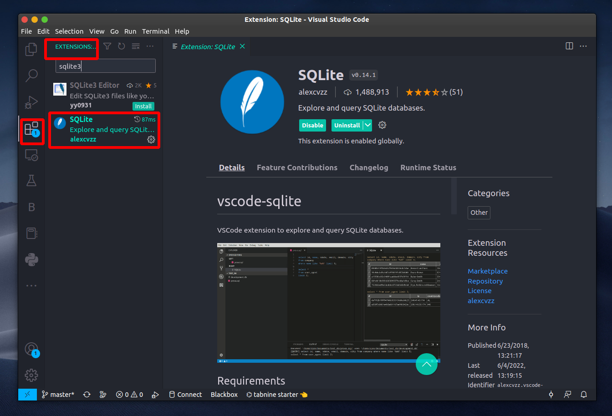

## A Good Way To Start With SQLite3 using Python

##### I will shed light on SQLite and explain the basics to work with database!

To begin, the natural question is, What is SQLite? According to the documentation:

```
SQLite is a C-language library that implements a small, fast, self-contained, high-reliability
full-featured, SQL database engine. SQLite is the most used database engine in the world. SQLite 
is built into all mobile phones and most computers and comes bundled inside countless other 
applications that people use every day.
```

To start, I will describe line-by-line the script in python that I wrote to do this task.

To do this tutorial, you will to install ```sqlite3``` and ```Faker``` python packages by the following command:

#### Install SQLite3 package:
```
python -m pip install pysqlite3
```

#### Install Faker package:

```
python -m pip install Faker
```


Setting the libraries used for this script are:

```
import sqlite3
from faker import Faker
import random
```

- **Faker**: Faker is a Python package that generates fake data ([HERE](https://andsilvadrcc.medium.com/how-to-generate-fake-data-using-the-faker-python-package-b6734b944cb2) I wrote a tutorial of How to use this library)
- **random**: This module implements pseudo-random number generators for various distributions

Next thing to do is to create a new database and open a database connection to permit ```sqlite3``` to work:

```
# create and open the database.
db = sqlite3.connect("dataset/database.sqlite")
```

Now, we need to create and initialize the faker generator, which to generate the data.

```
# faker object.
fake = Faker()
```

Using the database created above ```db```, I will execute the command ```CREATE TABLE``` in SQL to create the tables: **clients** and **orders**:


```
# create tables 
db.execute('''CREATE TABLE IF NOT EXISTS clients (id_client, name_client, phone,
              email, age, country, job, company, address, date_register)''')

db.execute('''CREATE TABLE IF NOT EXISTS orders (id_order,id_client, date_order, 
              product, credit_card, credit_card_number, price_product)''')
```

I also add one condition(```IF NOT EXISTS```) to the command ```CREATE TABLE``` this will pervent to create table if already exist, for the tables clientes and orders.

For the table clients, the columns created were:

- id client
- name Client
- phone
- email
- age
- country
- job
- company
- address
- date register

and for the table orders, the columns created were:

- id order
- id client
- date order
- product
- credit card
- credit card number
- price product

As we already know SQLite is a relational database management system (RDBMS), so we can see that the tables are related through of the column ```id client```.

For this tutorial, I will generate fake data to workaround with SQLite3, ***the fake data will be used for study purposes only.***

The next step is to create line-by-line the data for each column in tables clients and orders.

```
# generate fake data.

for id in range(1,10):

    # client information.
    id_client = id
    name_client = fake.name()
    phone_number = fake.phone_number()
    email = fake.email()
    country_name = fake.country()
    country = country_name.replace("'", "") #remove character (') when passed to SQL command.
    age = random.randint(18, 80)
    job_name = fake.job()
    job = job_name.replace("'", "") 
    company_name = fake.company()
    company = company_name.replace("'", "")
    address = fake.address()
    date_register = fake.date_between(start_date='-3y', end_date='today')
    
    # insert data into the table clients.
    db.execute(f'''INSERT INTO clients VALUES({id_client}, '{name_client}', 
                                             '{phone_number}', '{email}', {age}, 
                                             '{country}', '{job}', '{company}', 
                                             '{address}', '{date_register}')''')
    
    # client order.
    id_order = random.randint(1, 10000)
    date_order = fake.date_between(start_date='-90d', end_date='today') # 3 months ago!
    product = fake.file_extension()
    credit_card = fake.credit_card_provider()
    credit_card_number = fake.credit_card_number()
    price_product = fake.pricetag()

    # insert data into the table orders.
    db.execute(f'''INSERT INTO orders VALUES({id_order}, {id_client}, 
                                            '{date_order}', '{product}', 
                                            '{credit_card}', {credit_card_number}, 
                                            '{price_product}')''')
```

As you can see above, In the loop ```for``` the python library ```Faker()``` does the creation of the data that are inserted into the database(```db```) for clients and orders tables.

To execute SQL statements and to get SQL queries, We need to create a database cursor to used, as shown below: 

```
# create a Cursor object and call its execute() 
# method to perform SQL commands:
cursor = db.cursor()
```

Now with the ```cursor``` that query for clients and orders can be executed by calling the command:

```
# print the tables

# clients
for row in cursor.execute('SELECT * FROM clients'):
    print(list(row))

# orders
for row in cursor.execute('SELECT * FROM orders'):
    print(list(row))
```

In the end after the database has been written, we can call ```close()``` to close the connection to the database:

```
cursor.close()
```

And to finish, the commit any pending execution to the database

```
# save (commit) the changes
db.commit()
```

Close and done:

```
# we can also close the connection if we are done with it.
# Just be sure any changes have been committed or they will be lost.
db.close()
```

The folder have:


The file ```createdatabase.py``` is on my github repo - [HERE](https://github.com/andvsilva/data_science_journey/blob/master/database_SQLite3/createdatabase.py)

First, run the python script:

```
## folder: database_SQLite3

python createdatabase.py
```

This will create the database in the folder ```database``` called ```database.sqlite```

Now I will show the database on the visual studio code.

To do the next step, you will need to install an extension on visual sutdio code called SQLite as shown below:



To open the database on the visual studio code: ```crtl+shift+p```


Just click on ```SQLite Open Database``` and to explore the database, just go to the left side down to see the ```SQLITE EXPLORE``` as shown in the figure below:


and

