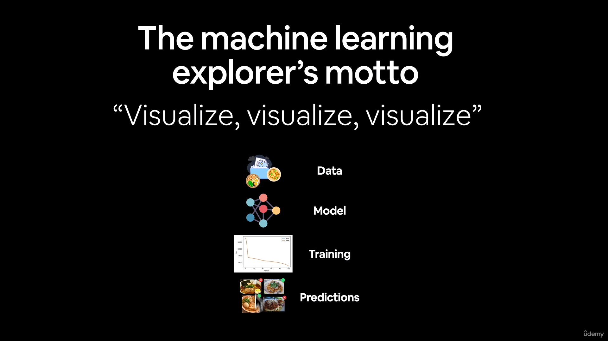

## TensorFlow Developer Certificate Bootcamp

**Pass the TensorFlow Developer Certification Exam by Google. Become an AI, Machine Learning, and Deep Learning expert!**

Author: @andvsilva

***NOTE: This documentation is to study only!***

### What you'll learn
 - [x] Learn to pass Google's official TensorFlow Developer Certificate exam (and add it to your resume)

 - [x] Build TensorFlow models using Computer Vision, Convolutional Neural Networks and Natural Language Processing
 
 - [x] Complete access to ALL interactive notebooks and ALL course slides as downloadable guides

 - [x] Increase your skills in Machine Learning and Deep Learning, to test your abilities with the TensorFlow assessment exam
 - [x] Understand how to integrate Machine Learning into tools and applications
 - [x] Learn to build all types of Machine Learning Models using the latest TensorFlow 2
 - [x] Build image recognition, text recognition algorithms with deep neural networks and convolutional neural networks
 - [x] Using real world images to visualize the journey of an image through convolutions to understand how a computer “sees” information, plot loss and accuracy
 - [x] Applying Deep Learning for Time Series Forecasting
 - [x] Gain the skills you need to become a TensorFlow Certified Developer
 - [x] Be recognized as a top candidate for recruiters seeking TensorFlow developers

### Course Content

- [x] **0 — TensorFlow Fundamentals**
    - [x] Introduction to tensors (creating tensors)
    - [x] Getting information from tensors (tensor attributes)
    - [x] Manipulating tensors (tensor operations)
    - [x] Tensors and NumPy
    - [x] Using @tf.function (a way to speed up your regular Python functions)
    - [x] Using GPUs with TensorFlow

- [x] **1 — Neural Network Regression with TensorFlow**
  - [x] Build TensorFlow sequential models with multiple layers
  - [x] Prepare data for use with a machine learning model
  - [x] Learn the different components which make up a deep learning model (loss function, architecture, optimization function)
  - [x] Learn how to diagnose a regression problem (predicting a number) and build a neural network for it

- [x] **2 — Neural Network Classification with TensorFlow**
  - [x] Learn how to diagnose a classification problem (predicting whether something is one thing or another)
  - [x] Build, compile & train machine learning classification models using TensorFlow
  - [x] Build and train models for binary and multi-class classification
  - [x] Plot modelling performance metrics against each other
  - [x] Match input (training data shape) and output shapes (prediction data target)

- [x] **3 — Computer Vision and Convolutional Neural Networks in Tensorflow**
  - [ ] Build convolutional neural networks with Conv2D and pooling layers
  - [ ] Learn how to diagnose different kinds of computer vision problems
  - [ ] Learn to how to build computer vision neural networks
  - [ ] Learn how to use real-world images with your computer vision models 

Machine Learning is turning things(data) into numbers and finding patterns in those numbers.

- [Rules of Machine Learning](https://developers.google.com/machine-learning/guides/rules-of-ml/)

### Deep Learning

A subset of machine learning, or deep learning, is basically a three-layer neural network. By simulating human brain function, although not exactly mimicking it, these neural networks enable the human brain to "learn" from vast quantities of data.

Deep learning is unique in that it can automatically find complex representations and patterns in data, frequently without the need for explicit programming. Deep learning algorithms—particularly deep neural networks—have demonstrated impressive performance across a range of tasks, including speech recognition, picture identification, and natural language processing.

Recurrent neural networks (RNNs) for sequential data, transformers for tasks like language modeling and translation, and convolutional neural networks (CNNs) for image-related tasks are some common deep learning designs. These deep neural networks are often trained using methods like stochastic gradient descent and backpropagation, which involve changing the parameters of the network to reduce the discrepancy between expected and observed outputs.

### Neural Networks

Neural networks, like those found in the human brain, are computational models whose architecture and operation are modeled after biological neural networks. It is made up of layers of linked nodes, or neurons. After processing incoming data, each neuron generates an output signal.

### Types of Learning

- Supervised Learning
- Semi-supervised Learning
- Unsupervised Learning
- Transfer Learning

### The Machine Learning Explore's Motto

#### Resources:

- [Zero to Mastery Deep Learning with TensorFlow course - GitHub](https://github.com/mrdbourke/tensorflow-deep-learning)
- [beautiful online book version of the course](https://dev.mrdbourke.com/tensorflow-deep-learning/)