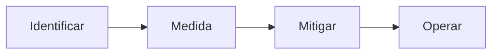

## AI Generativa

"Inteligência Artificial Generativa", ou "AI Generativa", é um termo usado para descrever sistemas de computadores que têm a capacidade de criar novos dados, como imagens, texto ou áudio, que se parecem com o que aprenderam em seus conjuntos de dados de treinamento. Esses sistemas são frequentemente usados em atividades criativas, como arte digital, escrita criativa e síntese de voz. Eles são diferentes dos sistemas que fazem previsões ou classificações com base nos dados de entrada.

#### Explorando os Recursos de IA Generativa com Copilot e OpenAI

Planejar uma solucao de IA generativa responsavel.

- As Quatro fases do processos para desenvolver e implementar um plano de IA responsavel sao:

- Identificar:
  - Possiveis danos relevantes para a solucao planejada.
- Medida:
  - A presenca desses danos nas saidas geradas pela solucao.
- Mitigar
  - Os danos em varias camadas em solucao para minimizar a presenca e impacto deles.
- Operar:
    - A solucao com responsabilidade definindo e seguindo um plano de implementacao e de preparacao operacional.

#### Microsoft Copilot

O Microsoft Copilot é uma ferramenta de assistência à codificação alimentada por inteligência artificial, desenvolvida pela GitHub em colaboração com a OpenAI. Ela foi projetada para ajudar os desenvolvedores, fornecendo sugestões, autocompletar e até mesmo trechos de código completos enquanto escrevem código. O Copilot funciona analisando o contexto do código sendo escrito e tirando proveito de um vasto repositório de código disponível publicamente no GitHub para oferecer sugestões inteligentes.

A ferramenta é construída com base na arquitetura GPT (Generative Pre-trained Transformer) da OpenAI, o que permite que ela entenda e gere código em várias linguagens de programação. O Copilot tem como objetivo aumentar a produtividade do desenvolvedor, acelerando o processo de codificação, reduzindo erros e ajudando os desenvolvedores a aprenderem novas técnicas de programação.

No entanto, é importante observar que, embora o Copilot possa ser uma ferramenta útil, **ele não substitui os desenvolvedores humanos**. Ainda está em estágios iniciais e os desenvolvedores precisam revisar e verificar as sugestões que ele fornece para garantir que atendam aos requisitos do projeto e aos padrões de codificação. Além disso, existem preocupações sobre possíveis questões de direitos autorais e licenciamento relacionadas aos trechos de código que ele gera, que os desenvolvedores devem estar cientes ao usar a ferramenta.

### Resource Links:

- [Módulo 5 - IA Generativa.pptx](https://academiapme-my.sharepoint.com/:p:/g/personal/nubia_dio_me/Ef88qA-boB1GuImGg67P-IQBAQP0mfwtVB0RjBnabfvdPw?e=PwuezC)

- [Explore generative AI with Microsoft Copilot](https://microsoftlearning.github.io/mslearn-ai-fundamentals/Instructions/Labs/12-generative-ai.html)
- [Explore Azure OpenAI](https://microsoftlearning.github.io/mslearn-ai-fundamentals/Instructions/Labs/13-azure-openai.html)
- [Explore content filters in Azure OpenAI](https://microsoftlearning.github.io/mslearn-ai-fundamentals/Instructions/Labs/14-azure-openai-content-filters.html)

- [Conceitos Basicos de IA do Azure](https://academiapme-my.sharepoint.com/:p:/g/personal/nubia_dio_me/EVdP5BFHxrJKgBBzFiK_UQMBWv4NAKXaMp4qkZyl27LaWw?rtime=EYcDH7wk3Eg)

- [Processamento de Linguagem Natural](https://academiapme-my.sharepoint.com/:p:/g/personal/nubia_dio_me/EV5UYBn9qcFIoNr6YocotJ8BnqhpFl7hR5KEQFqbIn1HQg?e=577iiz)
- [Visao Computacional](https://academiapme-my.sharepoint.com/:p:/g/personal/nubia_dio_me/EQqp6Nnsr0xMunDUSrLSIqUB3MDWZqY1Ob8vzVKLEjvQ_A?e=kCaDix)
- [Inteligencia de Documentos e Mineracao de Conhecimento](https://academiapme-my.sharepoint.com/:p:/g/personal/nubia_dio_me/EQwcYO0tKhlNuUCGjUEn3A0BZdug_Ll1ijFcSI5NdWfzkg?e=1jSzi6)